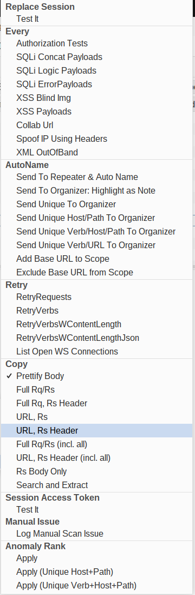
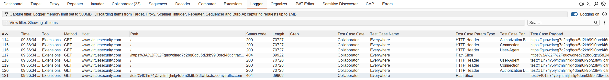
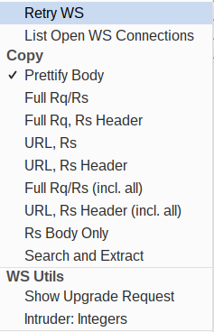
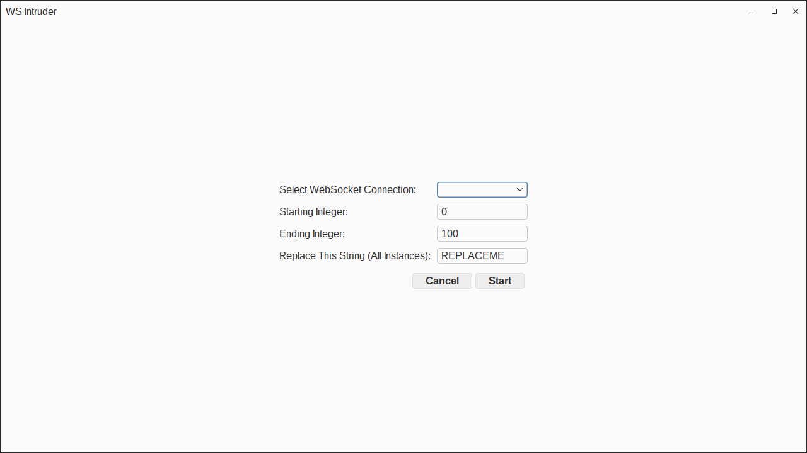
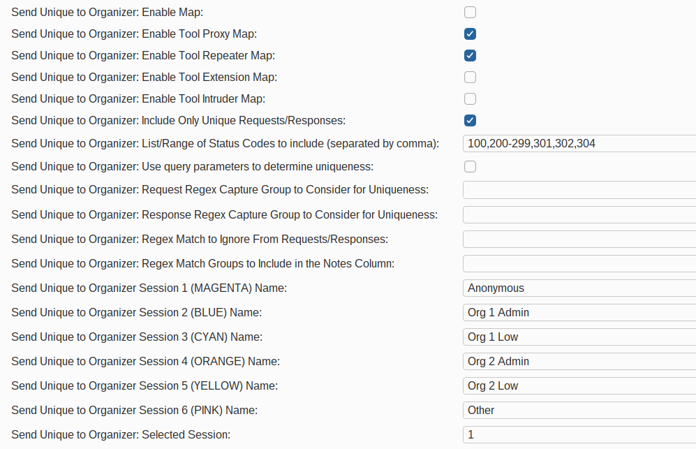
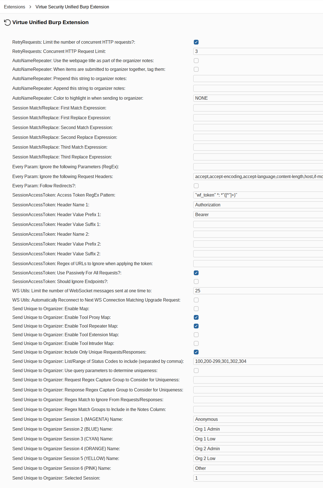

# Virtue Burp Power Tools

Virtue Burp Power Tools is a comprehensive collection of Burp Suite Pro extensions (built using the Montoya API and Kotlin) developed by Nick Coblentz at [Virtue Security](https://www.virtuesecurity.com). This toolkit is designed for testers to help them streamline the penetration testing process by automating test cases but allowing for manual review of the results, automating repetitive tasks, handling complex sessions handling, and efficiently extracting information for Markdown-based reporting.

## Key Features & Extensions

### 1. Match/Replace Session Handling Rule
Allows for multi-line regex match replace in requests and responses using session handling rules.

- **Session Handling Action**: Can be registered as a Burp Session Handling Action to automatically modify requests in real-time based on your rules.

### 2. Every Parameter

A powerful tool to launch common test cases across all parameters (URL, Body, JSON, Headers, Cookies) of one or more requests.
- **Payloads Included**:
  - **Authorization Tests**: Test for IDOR or permission bypass.
  - **SQLi (Concat, Logic, Error)**: Automated probing for various SQL injection types.
  - **XSS (Blind Img, Payloads)**: Test for reflected and stored XSS.
  - **Collab Url**: Inject Burp Collaborator URLs to detect out-of-band interactions.
  - **Spoof IP Using Headers**: Automatically add common IP-spoofing headers (e.g., `X-Forwarded-For`).
  - **XML OutOfBand**: Test for XXE and other XML-based vulnerabilities.
- **Logger Integration**: Use the dedicated "Logger" tab to review results
  - Includes Bambdas (you must add them from the library as logger columns) to extract out the Test Case Category, Name, Parameter, Payload, etc.

### 3. AutoName
Provides Some Additional Functionality On Top Of Sending Items to Repeater/Organizer
- **Send To Repeater & Auto Name**: Sends requests to Repeater and automatically names the tabs based on the HTTP method and path (e.g., `GET /api/v1/user`).
- **Send To Organizer: Highlight as Note**: Send an item to organizer, but add whatever text is selected in the request/response as a note.
- **Send Unique (various options) to Organizer**: In Logger, you can't add notes (a bug). If you want to apply anomaly rank, you have to send it to organizer first and then run anomaly rank and output the results in the notes column. These options automate that and give multiple options for how those requests/responses are grouped.
- **Add/Exclude Base URL to/from Scope**: Used when beginning an assessment to quickly add/remove items to scope without having to flip back to the Target → Scope Tab

### 4. Retry
Utilities for re-issuing requests (view the results in the logger tab) applying any session handling rules you've defined
- **RetryRequests**: Re-send selected requests to observe results in the logger.
- **RetryVerbs**: Automatically test multiple HTTP verbs (GET, POST, PUT, DELETE, etc.) against a single endpoint. Variants include options for Content-Length and JSON-specific bodies.

### 5. WebSocket Utilities
Enhancements for testing WebSocket-enabled applications.
- **List Open WS Connections**: Utility function to list currently open WebSocket connections.
- **Retry WS**: Resend a WebSocket Request (applying session handling rules)
- **Show Upgrade Request**: Popup and HTTP request/response window with the upgrade request used to create the WS Connection
- **Intruder: Integers**: Allows you to perform intruder like functionality (currently only iterating through integers) for the selected WS Payload, selecting an existing open WS Connection to send it through. This is different from other WS extensions in that you don't have to resend the upgrade request and mess with logging in and being authorized. Instead, you select an existing open connection.

### 6. Copy (Markdown Reporting)
Optimized for penetration testers who use Markdown for documentation.
- **Multiple Copy Modes** (examples):
  - Full Request/Response
  - URL, Response
  - URL, Response Headers
  - Full Request/Response (incl. all)
  - Response Body only
  - Request and/or Response Headers only
  - Search and Extract (regex across multiple items)
- **Prettify Body**: Automatically formats JSON/XML bodies for better readability in notes.

### 7. Session Access Token
Simplifies JWT and Bearer token management during testing.
- **Passive Extraction**: Watches responses for access tokens (via regex) and updates them globally.
- **Active Replacement**: Automatically injects the latest token into requests via a Session Handling rule.
- **Macro Support**: Integrates with Burp Login Macros to automatically refresh tokens when a session is invalidated (requires setup on your part).

### 8. Automatic Send Unique to Organizer
Instead of manually sending unique items to organizer through the right-click context menu, you can use the extension settings to automatically send request/response pairs to organizer if they are unique. This feature can be enabled through the extension settings.

- **Enable Map**: Turns on the functionality (named thus because it's used when mapping the application)
- **Enabled Tools**: Select which tools you want it to watch for unique request/responses
- **Include Only Unique**: If you uncheck this, it will send all request/responses regardless of whether its unique
- Filtering Options (choose which items to include or ignore):
  - Status Codes
  - Regex to ignore requests/responses
- Configurable Uniqueness Factors
  - Consider query parameters in uniqueness calculation
  - Use regex match groups for the request/response to extract data and consider for uniqueness
- Data Extraction
  - Regex match group to extract and add as a note in organizer
- User Sessions (Differentiate between which user you are mapping the application with)
  - Labels and colors (automatic highlight in organizer after 30 seconds - yep this is a workaround for a bug in Burp) for sessions 1-6
  - Select which session number you want to attribute activity to

#### Using with Session Handling Rules
1. In Burp settings, create a new Session Handling Rule.
2. Add action: "Invoke a Burp Extension" → select `Access Token Helper`.
3. In the helper settings, optionally enable "Use Passively For All Requests?" and configure scope/tools.

#### Using with a Login Macro (Auto-refresh on invalid session)
1. Record a Login Macro that authenticates to the target.
2. Ensure the login response contains a token that matches your configured regex (default expects `"access_token":"..."`).
3. Create a second Session Handling Rule using "Check session is valid".
   - Choose "Issue current request" and define validity checks.
   - If invalid: "Run a macro" → select your Login Macro.
   - After running the macro: "Invoke a Burp extension handler" → `Access Token Helper`.

### 9. Manual Issue
Provides a quick way to log manual scan issues directly into Burp's "Dashboard" or "Issues" view, ensuring that manually discovered vulnerabilities are tracked alongside automated findings.

### 10. Anomaly Rank
Uses the Anomaly Rank feature in burp to help identify "interesting" or "anomalous" requests. This version will add a note to each selected item with the rank value. 
- Modes include applying ranks to all, unique URL, or unique URL+Verb combinations.

---

## Configuration

---

## Setup

### Building the Extension
1. Clone the repository.
2. Build the JAR file using Gradle:
   - **Linux/macOS**: `./gradlew shadowJar`
   - **Windows**: `gradlew.bat shadowJar`
3. The resulting JAR will be located at: `build/libs/VirtueBurpPowerTools-x.y.z-all.jar`.

### Installation
1. In Burp Suite, go to the **Extensions** tab.
2. Click **Add**.
3. Select **Java** as the extension type.
4. Choose the generated JAR file and click **Next**.

